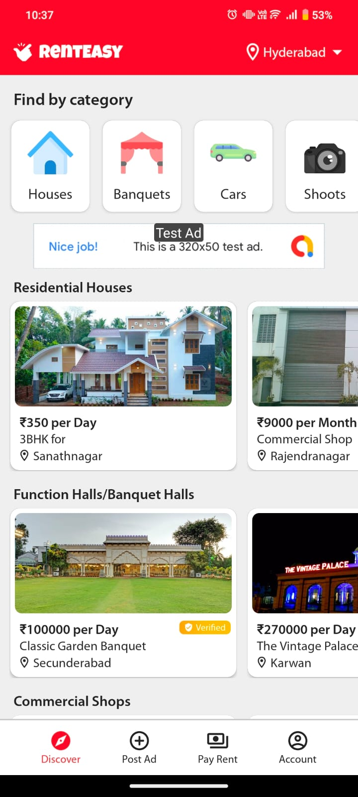
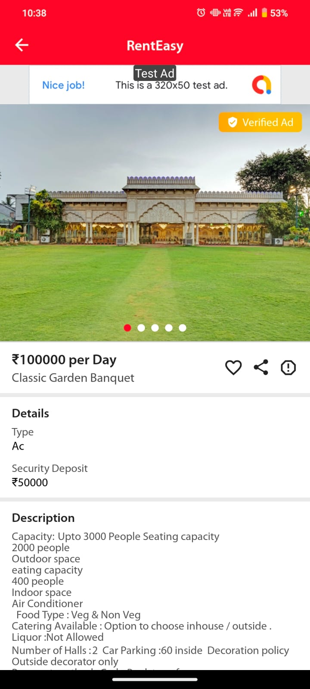
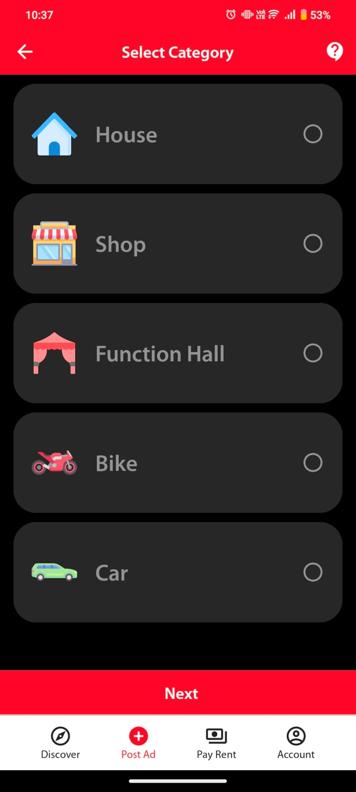
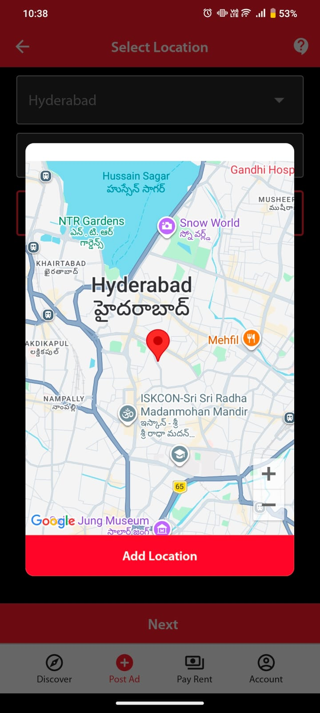
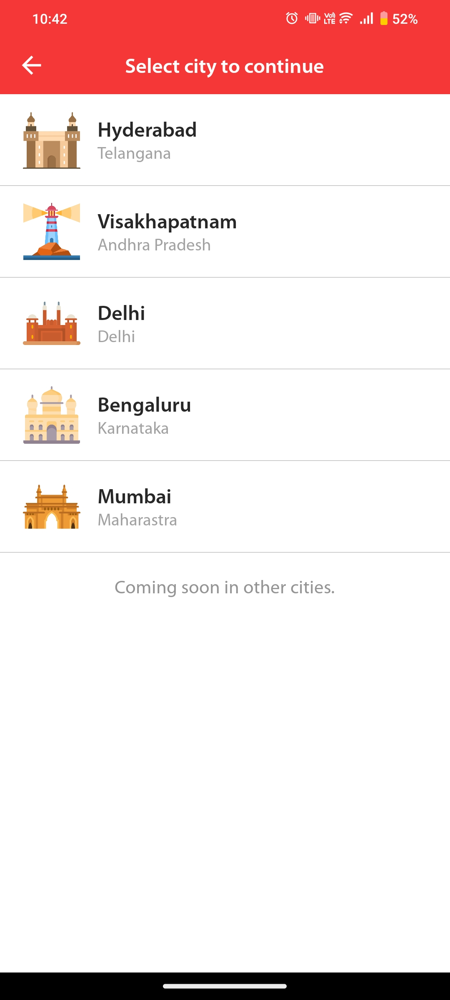
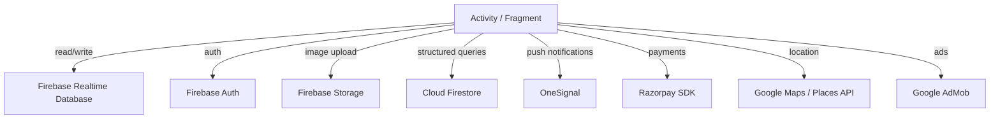

<p align="center">
  
</p>

<h1 align="center">RentEasy</h1>

<p align="center">
  A native Android rental marketplace for discovering and listing properties, vehicles, and everyday items for rent.
</p>

<p align="center">
  
  
  
  
</p>

---

## About

RentEasy is an Android application built to simplify the rental experience for tenants and landlords. It provides an intuitive, mobile-first marketplace where users can list and discover rental properties, vehicles, cameras, electronics, and other everyday items across multiple cities in India.

This repository contains the complete Android client codebase, open-sourced for reference, learning, and experimentation.

> **Note:** This project is archived and no longer actively maintained. The backend services (Firebase Realtime Database, Firebase Auth, Cloud Firestore) are no longer operational. The codebase is preserved as-is for educational purposes.

---

## The Story Behind RentEasy

RentEasy was my first serious software project.

I started building it in April 2020 when I was 15 years old and studying in 10th grade. The idea came from two problems I saw around me. I found it surprisingly difficult to find things available for rent, and at the same time my father was facing challenges finding tenants for our commercial property. Most existing platforms were focused on buying and selling, with very few offering a simple marketplace dedicated to rentals.

Curious to see if I could solve this problem myself, I began learning Android development and started building RentEasy. What began as a small experiment gradually evolved into a full-featured rental marketplace where people could list and rent properties, vehicles, cameras, electronics, furniture, and other everyday items.

Over the next two years, I worked on the project independently while balancing school. Without any marketing budget or external funding, the app grew entirely through organic reach and word of mouth. During its active development, RentEasy reached:

- 13,000+ installs
- 1,000+ user-generated listings
- Revenue through Google AdMob and in-app purchases
- Listings across multiple rental categories including homes, commercial spaces, vehicles, cameras, and electronics

More importantly, it gave me my first experience of building software for real users. I learned how to design user experiences, manage Firebase backends, handle production issues, collect user feedback, improve performance, and continuously ship new features based on real-world usage.

In 2022, after starting my Computer Science degree, I made the decision to stop actively developing RentEasy. As the project grew, it required significantly more time and resources to scale, and I wanted to focus on strengthening my engineering skills while exploring new areas such as artificial intelligence, on-device machine learning, and systems programming.

Although RentEasy is no longer maintained, it remains one of the most meaningful projects I have built. It taught me that building a successful product involves much more than writing code -- it requires understanding users, solving real problems, iterating quickly, and learning from every release.

---

## Screenshots

<table>
  <tr>
    <td align="center"><br/><sub>Home Screen</sub></td>
    <td align="center"><br/><sub>City Selector</sub></td>
    <td align="center"><br/><sub>Category Selection</sub></td>
  </tr>
  <tr>
    <td align="center"><br/><sub>Location Picker</sub></td>
    <td align="center"><br/><sub>Property Detail</sub></td>
    <td align="center"><br/><sub>Booking Dialog</sub></td>
  </tr>
</table>

---

## Features

- Browse rental listings across multiple categories (houses, shops, function halls, vehicles, cameras, electronics)
- City-based discovery with location-aware search
- Detailed property pages with image galleries, pricing, and descriptions
- User authentication via OTP and TrueCaller SDK
- Post and manage rental listings with image upload
- Booking and rental inquiry system
- Push notifications via OneSignal
- In-app rent payment flow via Razorpay and UPI
- Multi-language support (English, Hindi, Telugu)
- App intro onboarding for first-time users
- Shimmer loading effects and smooth UI transitions

---

## Architecture

The application follows a standard Activity-Fragment architecture pattern common in traditional Android development.

```
RentEasy
|
+-- activity/             # Screen-level controllers (Activity classes)
|   +-- SplashActivity        # App launch, SDK initialization
|   +-- LoginActivity         # Authentication (OTP, TrueCaller)
|   +-- HomeActivity          # Main container with bottom navigation
|   +-- DetailActivity        # Property detail view with image gallery
|   +-- SearchListActivity    # Filtered search results
|   +-- EditListingActivity   # Create and edit rental listings
|   +-- MyPostingsActivity    # User's own listings management
|   +-- CityChooserActivity   # City selection
|   +-- ...
|
+-- fragment/             # UI sections within HomeActivity
|   +-- HomeFragment          # Landing feed with categories and listings
|   +-- SearchFragment        # Search and filter interface
|   +-- PostListingFragment   # Multi-step listing creation form
|   +-- PayRentFragment       # Rent payment via Razorpay / UPI
|   +-- ProfileFragment       # User account and settings
|
+-- adapter/              # RecyclerView adapters for list rendering
|   +-- HomeItemAdapter       # Property cards on home feed
|   +-- SearchListItemAdapter # Search result items
|   +-- HomeCategoryAdapter   # Category grid items
|   +-- MyPostingsItemAdapter # User's own listing cards
|   +-- ...
|
+-- Utility/              # Data models and service classes
|   +-- HomeItems, SearchList, Category, ...   # POJOs / data models
|   +-- FirebaseMessagingService               # FCM push handler
|   +-- NetworkChangeListener                  # Connectivity monitor
|   +-- Common                                 # Shared utilities
|
+-- api/                  # Network and API layer
|   +-- Constants             # Endpoint URLs and keys
|   +-- Communicator          # HTTP request handler
|
+-- support/              # Helper utilities
|   +-- Preference            # SharedPreferences wrapper
|   +-- GpsTracker            # Location services helper
|   +-- Utils                 # General-purpose utilities
|
+-- views/                # Custom UI components
    +-- BoldTextView          # Custom styled TextView
```

### Data Flow



---

## Tech Stack

| Layer | Technology |
|---|---|
| Language | Java |
| Platform | Android (minSdk 21, targetSdk 30) |
| Build System | Gradle |
| Authentication | Firebase Auth, TrueCaller SDK |
| Database | Firebase Realtime Database, Cloud Firestore |
| Storage | Firebase Cloud Storage |
| Push Notifications | OneSignal |
| Payments | Razorpay, UPI Intent |
| Maps | Google Maps SDK, Google Places API |
| Ads | Google AdMob, InMobi |
| Image Loading | Glide, Picasso |
| Networking | Volley, Android Async HTTP |
| UI Components | Material Design, CircleImageView, ShimmerLayout, AppIntro, AutoImageSlider |

---

## Project Structure

```
RentEasy/
+-- README.md
+-- .gitignore
+-- Logo & Images/             # App logos and branding assets
+-- screenshots/               # App screenshots for documentation
+-- RentEasy-android/          # Android project root
    +-- build.gradle               # Project-level Gradle config
    +-- settings.gradle
    +-- gradle.properties
    +-- app/
        +-- build.gradle           # App-level dependencies and build config
        +-- proguard-rules.pro
        +-- src/
            +-- main/
            |   +-- AndroidManifest.xml
            |   +-- java/...           # Source code (see Architecture above)
            |   +-- res/
            |   |   +-- layout/        # XML layout files
            |   |   +-- drawable/      # Icons, shapes, backgrounds
            |   |   +-- values/        # Strings, colors, styles, themes
            |   |   +-- values-hi/     # Hindi translations
            |   |   +-- values-te/     # Telugu translations
            |   |   +-- mipmap-*/      # App launcher icons
            |   |   +-- ...
            |   +-- assets/            # Fonts and static assets
            +-- androidTest/           # Instrumented tests
            +-- test/                  # Unit tests
```

---

## Getting Started

### Prerequisites

- Android Studio Arctic Fox (2020.3.1) or later
- JDK 8
- Android SDK with API Level 30 (Build Tools 30.0.3)
- A Firebase project

### Setup

1. Clone the repository:

    ```bash
    git clone https://github.com/nikhilkeetha/RentEasy.git
    ```

2. Open the `RentEasy-android` directory in Android Studio.

3. Create a Firebase project at [console.firebase.google.com](https://console.firebase.google.com) and register an Android app with the package name:

    ```
    io.kodular.nsmarttechnologies6.RentEasy
    ```

4. Download the generated `google-services.json` file and place it in:

    ```
    RentEasy-android/app/google-services.json
    ```

5. Sync Gradle and build the project.

> **Note:** The app depends on backend data from Firebase Realtime Database and Cloud Firestore. Without populating these databases, most screens will appear empty. Refer to the source code for the expected data structure.

---

## Disclaimer

This project was originally developed as a personal startup effort between 2020 and 2022. It is open-sourced as a reference implementation and learning resource. The codebase reflects the development decisions made at the time and may not follow all current best practices.

Some third-party API keys referenced in the source code have been decommissioned. You will need to provide your own keys for Firebase, Google Maps, Razorpay, OneSignal, AdMob, and TrueCaller if you intend to run the application.

---

## License

This project is open source and available under the [MIT License](LICENSE).
